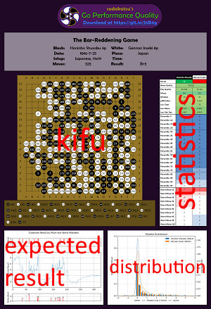

# go-performance-quality

Analyze Go games to generate metrics representing how well each player played.

### WARNING: This is _not_ distributed under a standard open-source software license.

> © 2022 Joseph Craig <the.sadakatsu@gmail.com>

This is an experimental project that I intend to turn into a full product.  I am releasing this code so that people can
use this tool for personal use.  If you wish to use this software, you may use the code to analyze Go games, and may
make minor modifications to this code to improve your personal edification.

Please do not copy this code or its algorithms into a separate project, especially for commercial or research projects.
I am continuing to develop these ideas in the hopes of being able to create a service using these ideas or possibly to
publish journal articles if I can get this process to be more powerful.  I have been working on this process for at
least a year now.  It would be painful for someone to grab this and profit off my work.

I do want people to be able to use this, so I am releasing this under an honor system.  I cannot enforce any license
that guarantees noncompete with me, so I will not even try.  Besides, the intent is to make something useful and 
helpful.  If you want to use this software in a way that I do not intend or condone, know that you could harm me.  That
should be sufficient to protect fair use.

Yes, I know _should_ is neither _must_ nor _will_.

Sadly, I must claim all standard legal protections in any event that one's use of this software does not provide the
results they wanted, regardless of the severity of their outcome.

If you are interested in collaborating or wish to request permission to use some portion of this project for a different
purpose than I generally described above, please contact me at `the DOT sadakatsu AT gmail DOT com`.

### Explanation
This program generates a scalar value that I call the Quality score for the game overall (Game Quality) and for
each performance in the game (Play Quality).  These numbers are calculated on the same scale so the three values for a
game can be compared against each other while still being meaningful (but not necessarily powerful) for comparing
performances across different games.

The basic idea behind the Quality Score should be fairly intuitive.

1. The best moves a player can play in a position are the minimax optimal moves.  These lose 0 points.  Any move that is
not the best move will lose some number of points based upon how bad a mistake the move is.
2. A player performs better in a position by losing fewer points with his move than by choosing a move that loses more.
3. A player's performance in a game is the set of losses he accrued for each move he played that game.
4. The game itself can be scored by combining both players' performances into one virtual performance.

Using the process described in the Methodology section at the bottom, the GPQ algorithm converts the three performances
into a number that is usually bounded between 100 (AlphaGo Master playing _really_ well) and 0 (low-level DDKs).  It is
possible to score outside this range; most people will not.

I have seen four basic scenarios while looking at this triple of Quality Scores across many games.

- The Game Quality is between the two Play Qualities, and the Play Qualities are well within 5-10 points of each other.
  That means that one player performed better than the other.  I recommend you study these games in particular when you
  lose them; one or more of your weaknesses might be identified by this game.
- The Game Quality is between the two Play Qualities, but the Play Qualities are far apart.  One player is stronger than
  the other, probably by several stones.  The loser might learn a little by studying the game.  It's better to just move
  on.
- Both Play Qualities are higher than the Game Quality.  I think these are games that were very difficult for some
  reason.  I suspect that both players should feel proud of such a game.  Study them if the Quality Scores are low.
  Analyze them if the Quality Scores are high to see what you saw, thought, or did differently.  Maybe you're on the
  verge of a breakthrough!
- Both Play Qualities are lower than the Game Quality.  I have seen this once with the Ear-Reddening Game.  That's too
  few samples to draw any real conclusion.

I do not yet have sufficient data to attempt to translate Quality Scores into possible ratings.  This is one of the
stretch goals for my project.

NOTE: We do not have a minimax oracle for Go.  I cannot score player performances objectively.  I use KataGo because it
estimates the game's expected result for each position.  Comparing the estimated results of its preferred move and the
player's move allows me to approximate having a minimax oracle.  This means that there are sometimes moves that have
negative losses: they gain points in reference to KataGo's preferred move, usually at the cost of winning rate
percentage points.  This is why I claim that GPQ generates "semi-objective" analysis of the games.  KataGo is biased,
but its biases have little overlap with those that cloud human judgment when evaluating games.

### Recommended and Discouraged Uses
I recommend Quality scores for the following purposes:

1. I personally have a hard time objectively evaluating how I played.  My emotions get the best of me.  I regularly feel
   like I played a terrible game, guessing that I would have a negative Quality score, only to run the algorithm and get
   a score multiple points higher than I thought.  Thus, the Quality score is good at giving a different perspective on
   one's performances, regardless of whether one uses it for the other purposes listed below or even agrees with the
   assessment.
2. These Quality scores do a good job of comparing an individual player's performances over time.  These scores captured
   when I fell into a bad slump, and gave me a way to compare games that had better scores with those with worse to find
   what changed.  I discovered that I had deviated from my old style of play; the games with higher scores were
   influence plus fighting, whereas my worst scores were when I tried to play territorial sabaki.  I started emphasizing
   my old style again, increased my average Quality score by roughly `+4`, and seem to indicate my improving at long
   last.
3. Related to the first point, this game can help identify what one does well and one does badly.  If one plays a game
   and receives a score much different than he expected, that game probably deserves a much closer look.  Abnormally
   poor performances can point out weaknesses or even blind spots in one's play.  Abnormally strong performances might
   indicate not just what one does well, but might show accidentally stumbling across a principle one did not recognize
   before.  In my case, sticking to a plan, even if it is a bad one, as opposed to flitting about trying to
   adapt to everything, though it took a dan friend to point out the differences there.
4. The Quality score is good at comparing the performances between two players for a particular game.  I have seen a few
   cases where the loser had a better Quality score.  It can be encouraging to see either that one was not outplayed too
   badly by one's opponent - or, in the case of sandbagging, to see that the discrepancy between the two players is more
   than one might have expected.

I discourage using Quality scores for the following purposes:

1. Estimating one's rating.  Stronger players are less likely to make larger mistakes, and are less likely to make
   mistakes at all.  However, the relative strength between the two players playing the game seems to have as much of an
   impact on their Quality scores as their individual strengths do.  Weaker players get punished for their mistakes more
   quickly, so they don't have sequences of missing the same key point over and over (something that is sure to flush a
   Quality score).  They are forced onto a better line of play through those punishments.  Stronger players also seem to
   play worse when playing weaker players, though I can only offer guesses as to why that is: they don't focus as much,
   they take a lead and get sloppy, they feel bad, etc.  As such, there is no clear mathematical relationship between a
   player's Quality score and one's rating.  It is better to use the Quality scores as a measure over time as described
   above, and to let whatever rating system one is using handle measuring the rating.
2. Comparing one's own performances to another person's over time.  Since these Quality scores do not clearly correlate
   to a measure of one's rating, one cannot expect to use them to compare their scores to another person's except when
   playing that person directly.  Their scores will be relative to their strength and their opponents' strengths.  It
   may be possible for two sets of players two get the same Quality scores, yet people reviewing the game could clearly
   conclude that one game was at a higher level than the other.
3. Obsessively trying to determine why one game was better than another.  This algorithm has quirks.  I have data that
   shows the current version is better correlated with the features than the previous two versions, but it is in some
   cases too concerned about the `p(Mistake)` stat and too unconcerned about how large the mistakes were.  I wish I
   could say that the scores generated are authoritative and unarguable.  I cannot.  Use them as a tool to help you, and
   ignore the occasional situation where you can see that the scores are "wrong".

### Set up for use

1. Navigate to the [KataGo](https://github.com/lightvector/KataGo/releases) releases page to download the version of
   KataGo that best matches your hardware.
2. Download a KataGo model. You can find the list of models that predate the KataGo Training project
   [here](https://katagotraining.org/networks/).  I recommend at least the [twenty-block, 256-channel model](
   https://media.katagotraining.org/uploaded/networks/models/kata1/kata1-b20c256x2-s5303129600-d1228401921.bin.gz).  It
   balances speed and strength well.  I discourage using a fifteen-block or shallower network, as that is likely to hurt
   the analysis quality.
3. If you downloaded an OpenCL KataGo version, I strongly recommend running a full tune. It can take many hours, but
   this program needs a deep analysis for each position to get a good assessment; whatever speed you can eke out is
   vital. You can do this by running the following command inside your KataGo directory: `katago tuner -model {MODEL YOU
   DOWNLOADED} -xsize 19 -ysize 19 -full -batchsize {256 or whatever large value your hardware can support}` . If you
   have multiple GPUs and plan to use only a subset, you may also need to add `-gpus {COMMA-SEPARATED LIST OF GPU
   IDENTIFIERS}`.
4. Copy `oracle.cfg` from this repository into your KataGo directory.
5. Install some form on Anaconda.  I use [miniconda](https://docs.conda.io/en/latest/miniconda.html), so I will write my
   guide for it.
6. Clone this repository, then navigate into that directory.
7. Build a new Python environment, installing this program's dependencies: `conda env create -f environment.yml`
8. Modify `configuration/application.yaml` so the `katago` subproperties are correct.  You may also want to change your
   `analysisThreads` value.  If you have a powerful, tensor-core equipped GPU, and you tend to analyze longer games,
   bumping your analysis threads to 32 can get you better throughput.  If you don't have a recent graphics card or use
   more economical models, you may want to reduce this to 8 or even 4.  Keep in mind that each one of these threads will
   review one position at a time, so you will find diminishing returns for increasing this value ever higher.  I have
   noticed no benefit to using any values other than binary powers.  Also, for no reason I understand, using two
   analysis threads does not better than using one.

### For each use:

1. Activate your conda environment: `conda activate goperformance`
2. Navigate into your repository clone.
3. Run the application: `python main.py {path to the SGF file of interest}`

You should see output like the following the first time you analyze an SGF.  If you run it for the same file multiple
times, it will reuse the past analysis and skip running KataGo again.

```

(goperformance) C:\Users\josep\source\repos\go-performance-quality>python main.py C:\Users\josep\Dropbox\Kifu\professional\ear-reddening-game.sgf
Evaluating C:\Users\josep\Dropbox\Kifu\professional\ear-reddening-game.sgf...
Parsing SGF succeeded.
DEBUG: path is 1846-07-25__19x19-0-Gennan_Inseki-8p-vs-Honinbo_Shusaku-4p__ear-reddening-game.csv
{'GM': 1, 'FF': 4, 'SZ': 19, 'PW': 'Gennan Inseki', 'RE': 'B+3', 'PB': 'Honinbo Shusaku', 'PC': 'Japan', 'WR': '8p', 'BR': '4p', 'DT': '1846-7-25', 'KM': 0, 'GN': 'The Ear-Reddening Game'}
Starting KataGo...
KataGo started.
Sending game for analysis...
1 positions analyzed.  Turn 13 completed; 28.587 seconds elapsed; 28.587 SPP.
2 positions analyzed.  Turn 17 completed; 28.650 seconds elapsed; 14.325 SPP.
3 positions analyzed.  Turn 15 completed; 29.777 seconds elapsed; 9.926 SPP.
# lines removed to conserve space
324 positions analyzed.  Turn 321 completed; 1038.733 seconds elapsed; 3.206 SPP.
325 positions analyzed.  Turn 319 completed; 1043.356 seconds elapsed; 3.210 SPP.
326 positions analyzed.  Turn 325 completed; 1048.216 seconds elapsed; 3.215 SPP.
All positions analyzed, compositing analysis...
Analysis complete.
Game reviewed in 1051.035 seconds (3.224 seconds per position).
Writing analysis to analyses/1846-07-25__19x19-0-Gennan_Inseki-8p-vs-Honinbo_Shusaku-4p__ear-reddening-game.csv...
Analysis saved.

Overall Quality: 89.959
Honinbo Shusaku (B)'s Quality: 89.872
Gennan Inseki (W)'s Quality: 84.679

Rendering performance table...
Rendering kifu...
Rendering distribution plots...
Compiling final infographic...

You can find your infographic at infographics/1846-07-25__19x19-0-Gennan_Inseki-8p-vs-Honinbo_Shusaku-4p__ear-reddening-game.png .
```



### Reading the Infographic

There are four useful sections within the generated infographic whose meaning may not be transparent.  These are the
kifu, the statistics table, the expected result graph, and the distribution plot.  They are labeled in the diagram to
the right.

#### Kifu
The kifu records the game from beginning to end in a single diagram.  If you have never seen a kifu before, each
intersection shows the first stone color that was placed in that intersection and the move number when it was placed
there.  Handicap stones have no numbers on them.  If there are turns that place a stone where another stone used to be,
or there are intermediate passes within the game, the callout beneath the kifu shows what color played that move, the
turn number when it occurred, and the coordinate at which that move was played (or "pass" if it was a pass).  If you
have seen a kifu before, the only difference is that I opted to use a more modern convention of using the replaced
stone's coordinate instead of move number.  I personally hate searching the diagram twice for finding a move I did not
expect.

The kifu serves three purposes in the infographic:

1. If you keep a collection of your analyses (please do!), the kifu can provide a quick way to identify at which game
   you are looking.
2. You can use it to review your game on a real board while also looking at the other analysis data when you choose.
3. I think it makes the infographic look nice.


### Statistics table
The statistics table could be considered the whole point of GPQ.  It shows how each player played, using color-coding
for quick comparisons (my apologies to the color blind; I do not know a better way to differentiate data at a glance).
The first column shows the row labels, the second column captures the metrics for Black, and the third column captures
the metrics for White.  The table is vertically divided into three subtables that help paint the whole picture of how
the game went.

#### Top section: scores
The scores section gives the high-level view of the game.  The rows capture the following metrics with the given
meanings and color coding scales:

- `Result`: Which player won.  Some argue that this is the most important metric.  I guess they've never had a win they
  feel badly about or a loss they feel good about.  Win is green, loss is red, no result is yellow.
- `Game Quality`: The Quality Score generated for the virtual performance representing both players.  This is the only
  cell that refers to both players.  See the [Explanation](#Explanation) section on guidance for interpreting it.  It is
  color-coded with a gradient.  100 is a green, 50 is a yellow, and 0 is a red.
- `Play Quality`: The Quality score calculated for the player's performance.  It is colored using the same gradient as
  Game Quality so the three values can be compared at a glance.  If you cannot distinguish the colors, the game was
  probably a good match-up!
- `Moves`: How many moves each player made.  The number of moves has a direct impact on how "sparse" the feature vector
  for the performance is; more moves means a more trustworthy analysis.  You can think of this color coding as
  representing how seriously you can take the score.  Red means "not very seriously", white means "seriously", and green
  means "very seriously".
- `Mistakes`: How many moves each player made that lost 0.5 moku or more.  This is color-coded to be identical to the
  color-coding for p(Mistake) below.
- `p(Mistake)`: The proportion of moves each player made that were mistakes.  This is literally `Mistakes / Moves`.  This
  is color-coded with a gradient.  0 is a green, 0.519 is a yellow (the mean p(Mistake) from my dataset), and 1 is a
  red.
- `Loss Total`: A situationally useful metric.  It is intended to capture the total number of points each player risked
  with his mistakes over the course of the game.  However, most games have moves where at least one player finds a move
  that gains points against KataGo's selected move.  I have seen this happen in an AlphaGo Master self-play game where
  a move Black played was a 14-point "mistake", but Black's next move after that was a 15-point "gain".  I tried a few
  schemes to try to make this generally useful.  Sadly, a straightforward sum of the rounded mistake values is the best.
  So, if you see a game where the Loss Total looks low in comparison to the Ten Worst Mistakes, ignore it.<br>It is
  color-coded on a gradient with 0 as a green, 187 as a yellow (the mean loss total from my dataset), and 634 as a red.
- `Loss Mean`: Literally `Loss Total / Moves`.  It is the average number of moku each player lost per move.  It is
  color-coded on a gradient with 0 as a green, 2.056 as a yellow (the mean loss mean from my dataset), and 6.392 as a
  red.
- `Loss Std. Dev.`: The standard deviation of each player's mistakes in moku.  This score is useful for showing how
  consistently a player performed that game.  It is color-coded on a gradient with 0 as a green, 3.163 as a yellow (the
  mean from my dataset), and 9.207 as a red.

#### Middle section: loss distribution
This section uses [percentiles](https://en.wikipedia.org/wiki/Percentile) to non-parametrically show how well each
player performed that game.  Each row is labeled as `Percentile: x` to show which percentile it represents, and the rows
increase from the fifth percentile to the ninety-fifth by increments of five.  You can use the row's label and the value
to mean `x percent of this player's moves cost him y moku or less`.  For example, in the Ear-Reddening Game, the table
shows that 95% of Shuusaku's moves cost him 3 moku or less.

These are color-coded with a gradient so you can compare the two players' performances side-by-side by their "shapes".
0 moku lost is a darkish blue, 1 is a moderate blue, 2 is a light blue, and 3 is white.  From there, it transitions to
a darkish red for the largest moku loss in the game.

If you are lucky enough to see negative values (gains!) in this  table, they might be so dark a blue you can't read the
text.  Stop playing better than KataGo.

This section combined with the ten worst mistakes section below tends to explain why one player beat another.

#### Bottom section: ten worst mistakes
This section shows the ten largest moku losses each player made during the game.  They are sorted in descending order.

You can likely learn a lot by studying just these ten moves from every game.  It depends, though; there are many games
where both players miss something really big for tens of moves in a row.  This results in the mistake distribution
getting skewed badly, and the analysis as a whole pointing at what is effectively one mistake.

The ten worst mistakes are color-coded on the same scale as the loss distribution section so the same number will be
colored the same way in both.

This section combined with the loss distribution section above tends to explain why one player beat another.

### Expected Result graph with ten worst timeline
These three graphs showed how the game swayed back and forth between the two players over the course of the game.  Each
of these graphs uses the same _x_-axis scale, using the move numbers as their values.  0 is the initial position.

The middle graph shows the game's expected result after each move.  A positive value indicates Black is leading, while a
negative value indicates that White is.  Naturally, the line bounces up and down as each player makes mistakes of
different magnitudes.

The top and bottom graphs show when each player played their ten worst mistakes.  The height of the bars show
comparatively how large each of these mistakes were.  The label on the bar attempts to show the last one or two digits
of the move number.  I never show hundreds on these to lessen overlap.

### Mistake Distribution plot
This plot shows two different representations of the data already presented in the Statistics table's loss distribution
section.  The first is a histogram representation, bucketing the loss values in increments of a quarter moku.  It uses
the left _y_-axis, `Proportion of Moves`, to indicate what ratio of the players' moves fell into that bucket.

The second representation is a Gaussian
[kernel density estimation](https://en.wikipedia.org/wiki/Kernel_density_estimation) of the players' performances.  The
very simple explanation is that this plot is trying to find underlying shapes of the distribution.  You can easily
ignore this if you do not know what KDE is or do not care.  I find looking for different subpopulations of mistakes
enlightening sometimes.

### Methodology
This version is GPQ's third incarnation.  This section details only version 3.

1. I collected over 1,000 games across a broad range of skill levels.  I have the AlphaGo Master games, professional
   games, amateur dan games, SDK games (primarily from my Thousand Nights of Go series at
   [Twitch](https://twitch.tv/sadakatsu)), DDK, and some AI games (some of which were artificially bad to try to plumb
   the depths).
2. I analyzed all these games using KataGo version 1.10 using CUDA 11.2 and the old 20 block, 256 channel network linked
   above.
3. I clustered the performances using the Mann-Whitney-U test with _p_ ≤ 0.025 and Pareto non-dominated sorting.
4. I transformed the performances into a massive feature vector to capture a performance's loss distribution.
5. I used Principal Component Analysis to center the feature vectors and reduce the number of dimensions.
6. I used Linear Discriminant Analysis to further reduce the dimensions based upon the clusters determined in Step 3.
7. I used Multiple Regression to find the vector along with the clusters are distributed.
8. I projected all my performances onto this vector.
9. I found the 5th and 95th percentiles of my performance data.  The 5th was defined as the Quality Score 100, the 95th
   as Quality Score 0.
10. I exported the parameters to be loaded and reused so that new performances can be scored along this same vector.